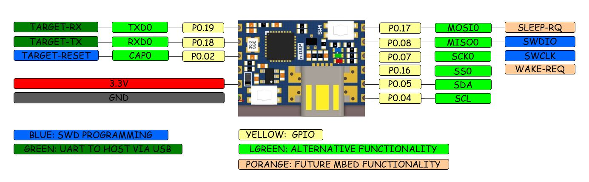
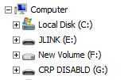
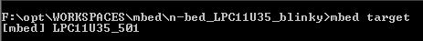
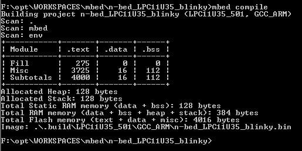

<slidy
 theme="nblocks" />

  ----------- -------------- --------------------- -------------------------------------------- -------------- ------------------------------------- ---------------------------------------------------------- ----------------------------------------------------------- -------------------- ------------------
  {{NBLOCKS   name = n-DAP   image = N-DAP-1.JPG   description = CMSIS-DAP Interface for mbed   Authors = NC   basedOn = [n-U35](n-U35 "wikilink")   url = [bitbucket](https://bitbucket.org/nimbus_it/n-dap)   url2 = [bitbucket](https://bitbucket.org/nimbus_it/n-dap)   ztatus = Prototype   bcolor = blue }}
  ----------- -------------- --------------------- -------------------------------------------- -------------- ------------------------------------- ---------------------------------------------------------- ----------------------------------------------------------- -------------------- ------------------

Pinout
------

{width="1000"}

-   The board has 12 pins, 6 for each side, If the board is used SWD
    only 3 pins for signals and 2 pins for power are needed

Background
----------

LPC11U32 based CMSIS-DAP programming of ARM Cortex devices via SWD.
Appears as a Disk to PC. Tested with mbed firmware.\
Provides **mbed-enable** capability and can be designed-in as an SMD
component or used as external programmer/debuger.\
\
\
\

\
\
\
\
\

Features
--------

<File:N-DAP-3.JPG> <File:N-DAP-2.JPG>

-   Breadboard-able: 1/10 inch connector pitch
-   Solder as SMD component: SMD half pads at 1/10' pitch
-   Robust USB mini connector:

\
\

mbed-enable Firmware
--------------------

### LPC1768

-   [**LPC11U32-Firmware** for communicating with
    LPC1768](https://developer.mbed.org/users/chalikias/code/mbed-HDK/)

\

### LPC812

The same as LPC1768 above\
\
===LPC1114FN28===

-   Firmware to use n-DAP with the non-SMD LPC1114FN28 DIP-28 [Firmware
    LPC1114FN28](https://developer.mbed.org/teams/Switch-Science/wiki/Firmware-LPC1114FN28)

\
===nRF51822===

-   [Seeed studio wiki Arch
    BLE](http://www.seeedstudio.com/wiki/Arch_BLE)
-   [Seeed studio wiki <File:Lpc11u35> nrf51822 if
    mbed.bin.zip](http://www.seeedstudio.com/wiki/File:Lpc11u35_nrf51822_if_mbed.bin.zip)

\
\

Using with mbed-CLI
-------------------

-   Checking the working target setup\

\
\
\* compile\
\
\
\* After pressing \[SW4+SW3\], then \[SW3 only\], then \[release
SW3\],CPU is in ISP mode and appears as Disk with name **"CRP
DISABLD"**\
\* Remove previous firmware from CPU flash by deleting the file
**firmware.bin**\
\*The folder should be empty\
\*Then just drag-drop the new compiled .bin to the mbed board. It should
appear as "**firmware.bin**"

\
\

Related articles in this Wiki
-----------------------------

-   

\
\
